## Configuration files for my homelab
**Running in a Raspberry Pi Zero 2**

### Services being used
- OpenMediaVault: NAS setup for file sharing and backup
- Pi-hole (with unbound): Local DNS server with filtering
- PiVPN: Private connection from mobile phone to the server
- Docker: Container environment for python web scraping scripts
- TTYD: Web interface to interact with the homelab
- Transmission: Torrent client

### System Architecture

```mermaid
---
config:
  layout: elk
---
flowchart TB
 subgraph Internet["Internet"]
        Phone["Smartphone (Remote)"]
        Laptop["Laptop (Remote)"]
  end
 subgraph subGraph1["Docker Stack"]
        WG["WireGuard VPN"]
        HM["Homer Dashboard"]
        PH["️Pi-hole DNS"]
        UN["Unbound"]
        FB["File Browser"]
        DZ["Dozzle"]
        OST["OpenSpeedTest"]
        TR["Transmission"]
        ST["Syncthing"]
        WT["Watchtower"]
        DK["Doku"]
  end
 subgraph subGraph2["Bare Metal Services"]
        SMB["SMB"]
        TTYD["TTYD"]
  end
 subgraph subGraph3["Iroha (Raspberry Pi Zero 2)"]
    direction TB
        subGraph1
        subGraph2
  end
 subgraph subGraph4["Home Network"]
        Router["Router"]
        subGraph3
  end
    Phone -- VPN Tunnel --> Router
    Laptop -- VPN Tunnel --> Router
    Router -- 51820 --> WG
    WG -- 80 --> HM
    WG -- 81 --> PH
    PH -- 5335 --> UN
    WG -- 82 --> FB
    WG -- 83 --> DZ
    WG -- 84 --> DK
    WG -- 8384 --> ST
    WG -- 9091 --> TR
    WG -- 3000 --> OST
    WG -- 7681 --> TTYD

     Phone:::ext
     Laptop:::ext
     Router:::hardware
     WG:::docker
     HM:::docker
     PH:::docker
     UN:::docker
     FB:::docker
     DZ:::docker
     OST:::docker
     TR:::docker
     ST:::docker
     WT:::docker
     DK:::docker
     SMB:::baremetal
     TTYD:::baremetal

```

### Important files / directories
- pi.sh: Documentation of my homelab configuration
- price-tracker: Directory with the web scraping scripts and Docker container configuration files. Currently able to get the price from the following websites:
    - Amazon
    - Kabum
    - Magazine Luiza
    - Mercado Livre
    - Pichau
    - Terabyte
    - Web Continental
- scripts: Directory with bash scripts for task automation
