# Hybrid Server Environment - Raspberry Pi Zero 2 + Oracle Cloud
This repository hosts the configuration files and scripts from my local and cloud servers

## Services being used
### Local Server
#### Bare metal
- Samba: File sharing
- TTYD: Web interface to interact with the homelab
- Fail2Ban: Authentication security

#### Containerized (Docker)
- Pi-hole (+ unbound): Local DNS server with filtering
- Wireguard: Private connection from any device to my local server
- Transmission: Torrent client
- File Browser: File Browser...
- Beszel: Server and Docker containers monitoring
- Homer: Web homepage
- Watchtower: Auto updater for Docker images
- DuckDNS: DDNS auto updater
- Memos: Note taking 

### Cloud Server
- Telegram API script: checks if local server is reachable from the internet, alerts on Telegram if it's down or up

## System Architecture

```mermaid
---
config:
  layout: dagre
---
flowchart TB
 subgraph Internet["Internet"]
        Phone["Smartphone"]
        Cloud["Cloud Server"]
  end
 subgraph subGraph1["Docker Stack"]
        WG["WireGuard VPN"]
        HM["Homer Dashboard"]
        PH["️Pi-hole DNS"]
        UN["Unbound"]
        FB["File Browser"]
        TR["Transmission"]
        WT["Watchtower"]
        MM["Memos"]
        BZ["Beszel"]

  end
 subgraph subGraph2["Bare Metal Services"]
        SMB["SMB"]
        TTYD["TTYD"]
        F2B["Fail2Ban"]
  end
 subgraph subGraph3["Iroha (Raspberry Pi Zero 2)"]
    direction TB
        subGraph1
        subGraph2
  end
 subgraph subGraph4["Home Network"]
        Router["Router"]
        subGraph3
  end
    Phone -- VPN Tunnel --> Router
    Cloud -- VPN Tunnel --> Router
    Router -- 51820 --> WG
    WG -- 80 --> HM
    WG -- 81 --> PH
    PH -- 5335 --> UN
    WG -- 82 --> FB
    WG -- 85 --> BZ
    WG -- 5230 --> MM
    WG -- 9091 --> TR
    WG -- 7681 --> TTYD

```

## Important files / directories
- pi.sh: Documentation of my homelab configuration
- alma.sh: Documentation of my OCI instance
- docker: Directory with all my docker-compose files and related configuration
- config: Local server configuration files
- scripts: Directory with bash scripts for task automation
    - tg_server_checks: Uses Telegram API to alert if my local server is unaccessible
    - speedtest-log.sh: Periodically tests local server internet speed
    - speedlog.sh: Shows historic data of internet speed test
- price-tracker: Directory with the web scraping scripts and Docker container configuration files. Currently able to get the price from the following websites:
    - Amazon
    - Kabum
    - Magazine Luiza
    - Mercado Livre
    - Pichau
    - Terabyte
    - Web Continental
